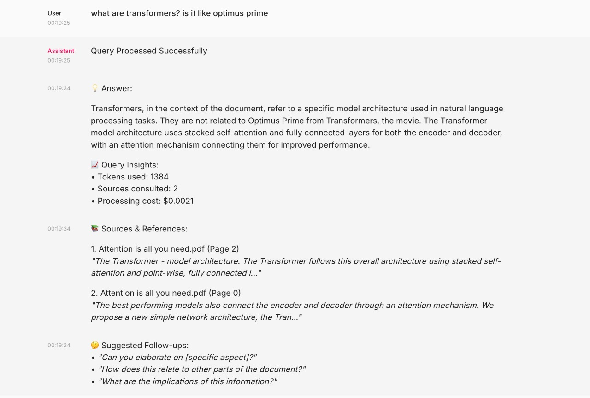

# Advanced RAG Document Intelligence System

A sophisticated Retrieval-Augmented Generation (RAG) system that brings your documents to life through intelligent conversation. Built with LangChain, Qdrant vector database, and Chainlit for an engaging user experience.


*Example of the system providing detailed answers with source citations and cost tracking*

## 🌟 Features

### 🧠 Smart Retrieval
- **Maximum Marginal Relevance (MMR)**: Finds the most relevant AND diverse information
- **Contextual Compression**: Extracts only the most important parts from documents
- **Semantic Search**: Understands meaning behind questions, not just keywords

### 💬 Conversational Memory
- **Intelligent Summary Buffering**: Remembers entire conversations efficiently
- **Context-Aware Responses**: Builds on previous questions and provides contextual follow-ups
- **Memory Management**: Automatically manages conversation flow and memory limits

### 📊 Advanced Analytics
- **Token Usage Tracking**: Monitor computational costs transparently
- **Source Citations**: Provides page numbers and document references
- **Quality Metrics**: Track retrieval performance and response metadata

### 🔍 Document Processing
- **Incremental Updates**: Only processes new or modified documents
- **Deduplication**: Avoids reprocessing unchanged files
- **Enhanced Metadata**: Tracks file hashes, processing dates, and chunk information
- **Multi-format Support**: PDF, TXT, MD, DOCX files

## 🚀 Quick Start

### Prerequisites

```bash
# Python 3.11.9
pip install -r requirements.txt
```

### Installation & Setup

1. **Clone the repository**
   ```bash
   git clone https://github.com/Qingzhee/rag-engine
   cd advanced-rag-system
   ```

2. **Install dependencies**
   ```bash
   python3.11 -m venv .venv
   # On macOS/Linux:
   source .venv/bin/activate
   # On Windows:
   .venv\Scripts\activate
   pip install -r requirements.txt
   ```

3. **Set up environment variables**
   ```bash
   cp .env.example .env
   # Edit .env with your API keys
   ```

4. **Prepare your documents**
   ```bash
   # Copy your PDF, TXT, MD, or DOCX files to the data folder
   ```

5. **Ingest documents**
   ```bash
   python ingest_documents.py
   ```

6. **Launch the interface**
   ```bash
   chainlit run app.py -w
   ```

## 📁 Project Structure

```
advanced-rag-system/
├── ui.py                    # Chainlit web interface
├── rag_chain.py             # Core RAG implementation
├── ingest.py                # Document processing and ingestion
├── config.py                # Configuration management
├── requirements.txt         # Python dependencies
├── .env                     # Environment variables
├── data/                    # Your documents folder
├── processed_files.json     # Processing log (auto-generated)
└── README.md                # This file
```

## Core Components

### Document Ingestion (`ingest_documents.py`)
- **Smart Processing**: Only processes new or modified files
- **Enhanced Metadata**: Tracks file hashes, sizes, and processing dates
- **Flexible Text Splitting**: Adaptive chunk sizes based on document length
- **Error Handling**: Comprehensive error tracking and reporting

### RAG Chain (`rag_chain.py`)
- **Advanced Retrieval**: MMR-based document selection
- **Contextual Compression**: LLM-powered content filtering
- **Conversation Memory**: Summary buffer for long conversations
- **Cost Tracking**: Detailed token usage and cost monitoring

### Web Interface (`app.py`)
- **Interactive Chat**: Engaging conversation interface
- **Real-time Feedback**: Processing status and system insights
- **Command Support**: Special commands for memory management
- **Rich Formatting**: Enhanced message display with source citations

### Configuration (`config.py`)
- **Flexible Settings**: Comprehensive configuration options
- **Environment Integration**: Easy deployment configuration
- **Runtime Adjustments**: Modify behavior without code changes

### System Commands
```
/clear    - Clear conversation memory
/stats    - Show memory and usage statistics
/info     - Display system information
```

## ⚙️ Configuration Options

The system supports extensive configuration through environment variables or the `config.py` file:

| Setting | Default | Description |
|---------|---------|-------------|
| `RAG_COLLECTION_NAME` | `my_documents` | Qdrant collection name |
| `RAG_LLM_MODEL` | `gpt-3.5-turbo` | OpenAI model to use |
| `RAG_TEMPERATURE` | `0.1` | Response creativity (0-1) |
| `RAG_MAX_TOKENS` | `1000` | Maximum response length |
| `RAG_CHUNK_SIZE` | `800` | Document chunk size |
| `RAG_CHUNK_OVERLAP` | `100` | Overlap between chunks |
| `RAG_RETRIEVAL_K` | `6` | Documents to retrieve |
| `RAG_MEMORY_MAX_TOKENS` | `800` | Memory buffer size |

## 🎯 Advanced Features

### Incremental Document Processing
The system automatically tracks processed files and only reprocesses changed documents:

```python
# Force reprocessing all documents
python ingest_documents.py --force-reprocess

# Process only new/modified files (default)
python ingest_documents.py
```

### Memory Management
Intelligent conversation memory with automatic summarization:
- Keeps recent messages in full detail
- Summarizes older conversation history
- Maintains context across long sessions

### Cost Tracking
Monitor your OpenAI API usage:
- Token consumption per query
- Estimated costs
- Processing efficiency metrics

### Source Citations
Every response includes:
- Document names and page numbers
- Relevant text excerpts
- Confidence indicators

## 🤝 Contributing

1. Fork the repository
2. Create your feature branch (`git checkout -b feature/AmazingFeature`)
3. Commit your changes (`git commit -m 'Add some AmazingFeature'`)
4. Push to the branch (`git push origin feature/AmazingFeature`)
5. Open a Pull Request

## 📝 License

This project is licensed under the MIT License - see the [LICENSE](LICENSE) file for details.

## 🙏 Acknowledgments

- [LangChain](https://github.com/hwchase17/langchain) - Framework for LLM applications
- [Qdrant](https://qdrant.tech/) - Vector similarity search engine
- [Chainlit](https://github.com/Chainlit/chainlit) - Python package for AI chat interfaces
- [OpenAI](https://openai.com/) - GPT models and embeddings
